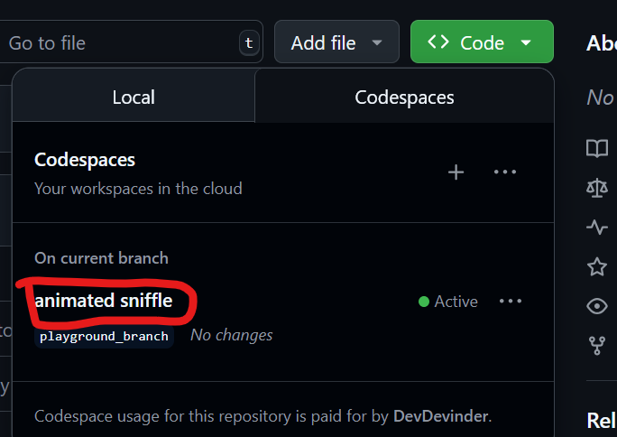
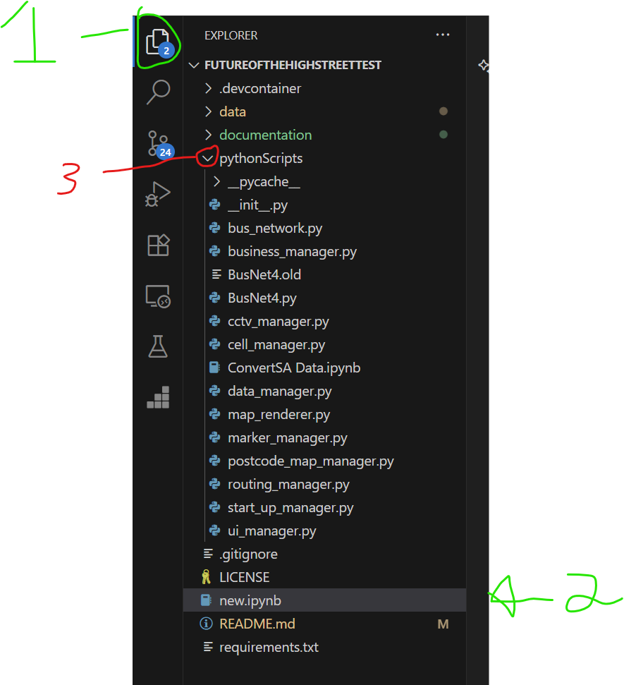

## Accessing the Notebook (via GitHub Codespaces)

If you are using GitHub Codespaces, heres how you can access the notebook:

first [Click this link to open the repository.](https://github.com/skamper1/Futureofthehighstreettest/tree/playground_branch)

> 1. Click the button near the top left. It will usually say "Main". If it says "playground", then it is already correct.  
> 2. Select the correct branch (version of the notebook) from the dropdown. "playground" is the branch for exploring the notebook for casual users.  
>
>   
> *Figure 1: Selecting the correct branch in GitHub.*

   

> 1. Make sure you are in the right Codespace.  
> 2. Click the green **Code** button  
> 3. Choose **"Open with Codespaces"**.  
>
>   
> *Figure 2: Opening the repository with GitHub Codespaces.*

   

> If you have done this before, then you may see an existing one. You can go ahead and click that instead (It may have created a strange name by default).  
>
>   
> *Figure 3: Selecting an existing Codespace.*

   

> A new page will open. This may take a while to load, especially if it is your first time - the loading progress can be seen on the bottom right.  
>
>   
> *Figure 4: Codespace loading progress.*

   

> Once loaded it can look something like this, but don’t worry - all you need to do is **open the notebook**, which can be found on the left side of the screen.  
>
>   
> *Figure 5: Loaded Codespace view.*

   

To open the notebook file:

> 1. If not open already, click the double page icon to open the **File Explorer**.  
> 2. Click the **new.ipynb** file to open the notebook (should be near the bottom of the list).  
> 3. Click any of the arrows like this `>` that are pointing down to collapse folders, this just makes things less cluttered and easier to find the notebook.  
>
>   
> *Figure 6: File Explorer showing notebook location.*

   

> Once you have opened the notebook it should look like this. The horizontal line at the bottom and the vertical line on the left are draggable if you wish to make more space for the notebook section of this screen.  
>
> You can also click the little X on the bottom right corner to remove the "terminal" area (you won’t really need this part), and you can also collapse the "file explorer" on the left by clicking the double page icon again.  
>
>   
> *Figure 7: Adjusting the Codespace layout.*

   

Congratulations -  you found the notebook!

---

## Additional Info

Here is some additional information to help you get going.

### Useful Buttons

At the top of the notebook, only these two buttons will be useful for casual users:  

>   
> *Figure 8: The notebook toolbar with useful buttons highlighted.*  
>
> - **Clear All Outputs:** Removes all the old stuff that has loaded, basically makes it look fresh and clean again.  
> - **Restart:** Restarts the notebook. Use this when starting fresh or if something isn’t working right.

>   
> *Figure 9: Play button to run a cell.*  
>
> To run a cell, press the play button (shown in the red circle above).  
>
> *Note: The above picture is of a "Cell". The term "cell" refers to a box with code, this is the part with colourful writing and green text, usually starting with something like `# Cell 1` or `# Cell 2` etc. Each cell tells the notebook what to do when you run it.*
