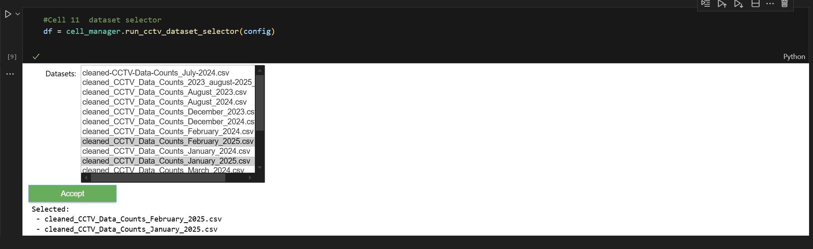
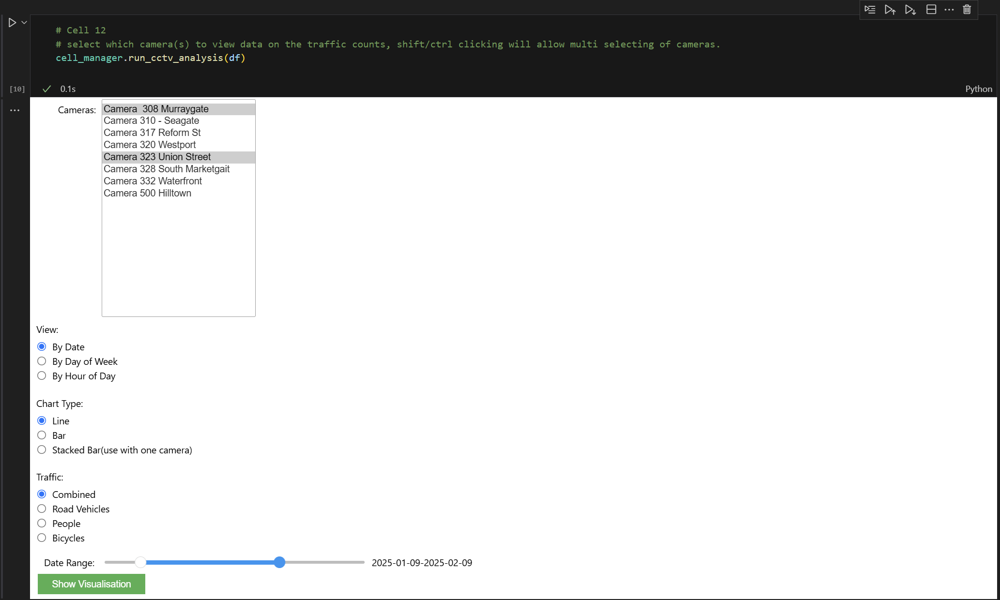
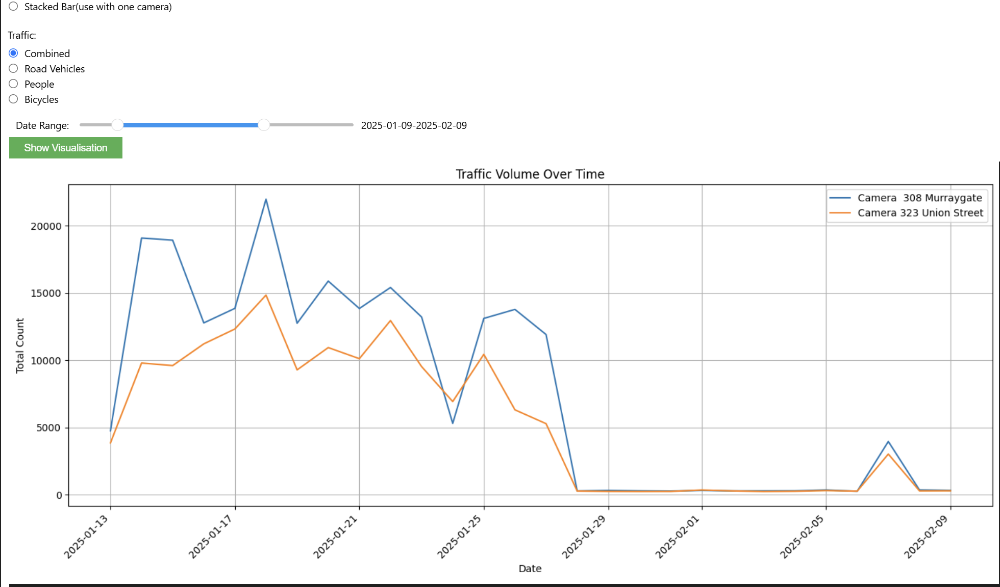
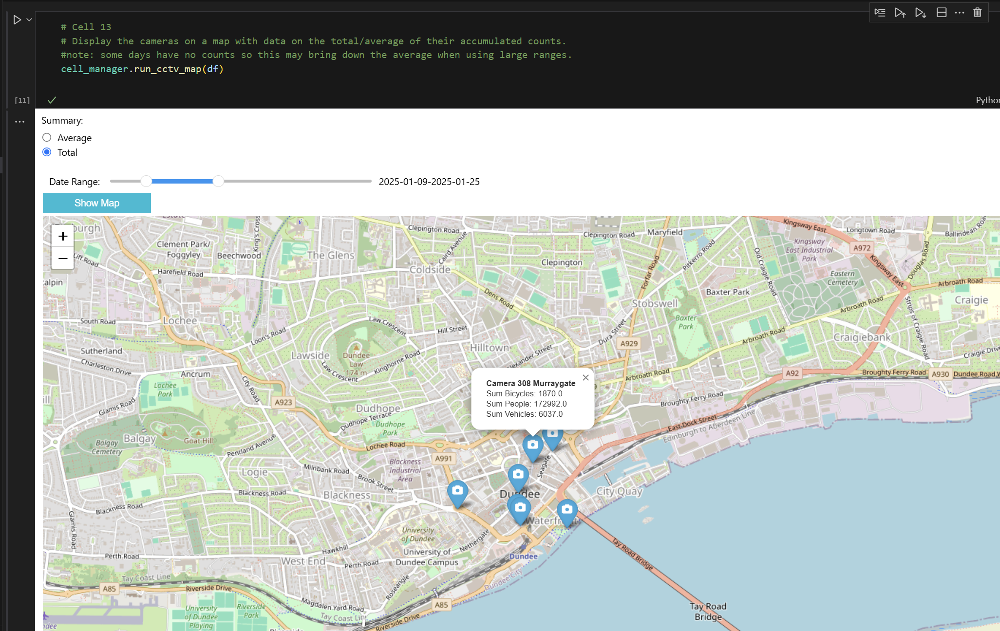
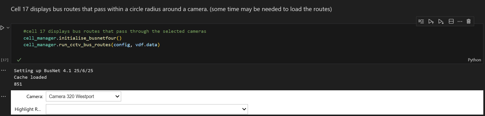
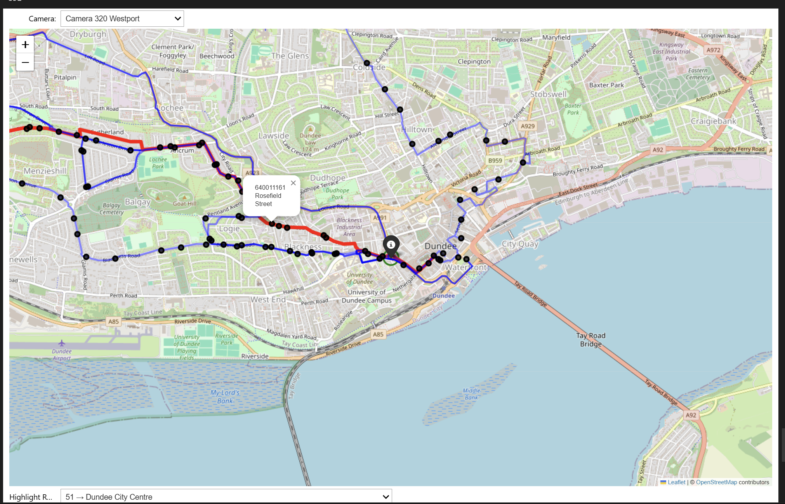

# Section 5 - CCTV

### Cell 11
Select the available dataset(s) you would like to work on.  
You can select more than one by holding the **SHIFT** or **CTRL** keys while clicking the datasets you like.  
Once happy with your selection, press **Accept** to finalise your choice.

The chosen datasets will be used by Cells 12 and 13.

>  
>*Figure 21: Cell 11 CCTV dataset selection UI.*

*Note: It’s better to choose datasets that are consecutive with no gaps in between for more accurate data visualisation.*

---

### Cell 12
This cell allows you to select the CCTV cameras you would like to see information on.  
You can select multiple cameras by holding **SHIFT** or **CTRL** while clicking cameras from the drop-down list.

You can then select:
- To view by date, day of the week, or hourly.  
- View a line graph or bar chart (stacked bar chart available when selecting only one camera).  
- Traffic type to include: vehicles, bicycles, people, or a combination.  
- A date range slider to adjust the period you are interested in.

Once all is decided, click the **Show Visualisation** button to confirm.

>**Example of selecting:**  
>  
>*Figure 22: Cell 12 CCTV camera selection UI.*

>**Example of graphical output:**  
>  
>*Figure 23: Cell 12 CCTV data visualisation output.*

---

### Cell 13
This cell will display the CCTV camera locations on a map, with the footfall counts.

You can choose:
- Total counts  
- Averages  
- Date ranges of interest using the slider

>*Note: Averages may be skewed by gaps in the datasets.*

>**Example output:**  
>  
>*Figure 24: Cell 13 CCTV camera map output.*

---

### Cells 14, 15, 16
These follow the same logic as Cells 11, 12, and 13.

---

### Cell 17
This cell displays all the bus routes that pass through (or nearby) the CCTV camera’s location.

Steps:
1. Run the cell  
2. Select a camera and wait for the map to load  
3. If the first camera in the drop-down is the one you want, select another then re-select the first one to trigger the map load

At the bottom of the map, there is a drop-down to allow you to highlight certain bus services/routes that may interest you.

>**Example UI:**  
>  
>*Figure 25: Cell 17 bus routes through CCTV camera UI.*

>**Example output:**  
>  
>*Figure 26: Cell 17 bus routes through CCTV camera output.*
