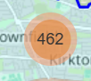

# Section 2 - Postcode Section

### Cell 3:  
This section deals with displaying postcodes on the map.  
You can select if you want to show postcodes within the whole city boundary or certain areas like city centre boundaries or even shopping districts.

To run this cell simply click the play button as before, select which boundary you would like to see postcodes inside, and then click **Accept** when you are ready to see them.  

*Keep in mind: the more postcodes we are expecting to see, the longer it will take to load.*

---

>Below is a video demonstrating this cell being run:  
>
><video src="Assets/vids/Running_Cell_Demo.mp4" controls width="600">
>  Your browser does not support the video tag.
></video>  
>
>*Figure 12: Running Cell 3 to display postcodes.*

---

>*Note:* Since there can be a lot of postcodes on the map, when zoomed out many postcode markers that are close to each other will be grouped into one marker with a number on it, like the picture below.
>
>  
>*Figure 13: Clustered postcode markers.*
>
>Zooming in or clicking on this will show the postcodes spread out in their proper places.
