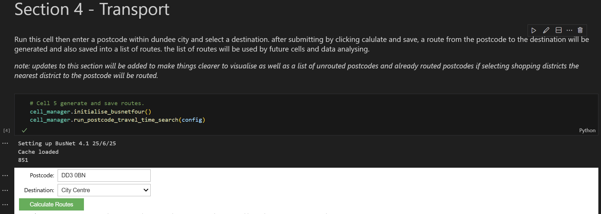
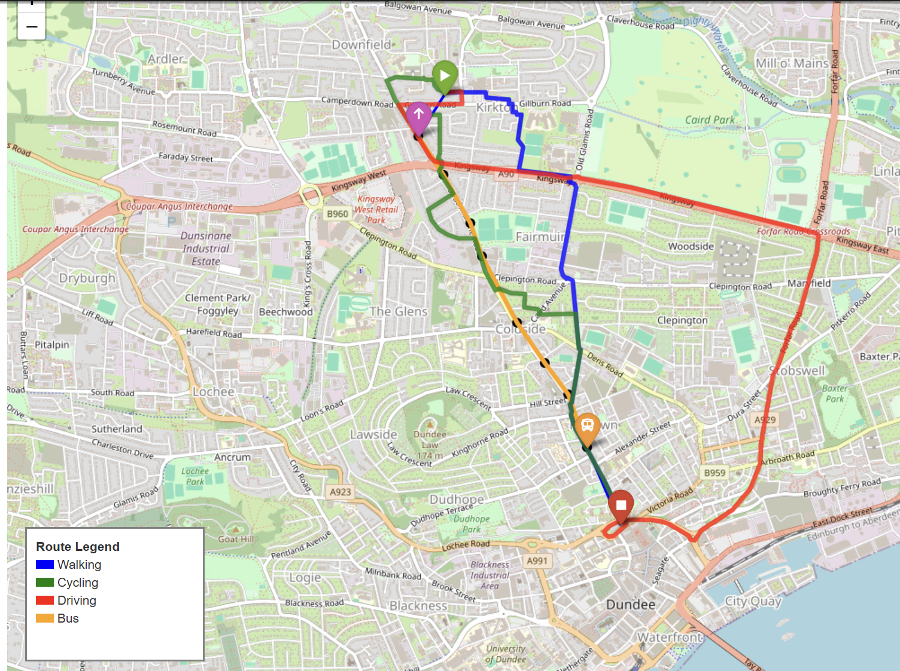
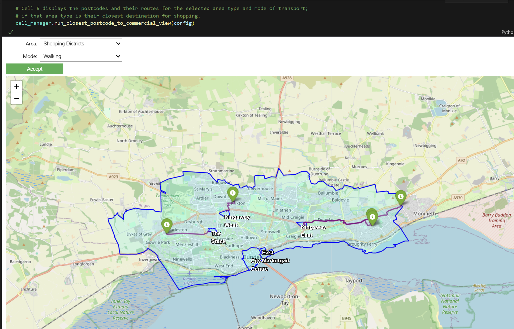
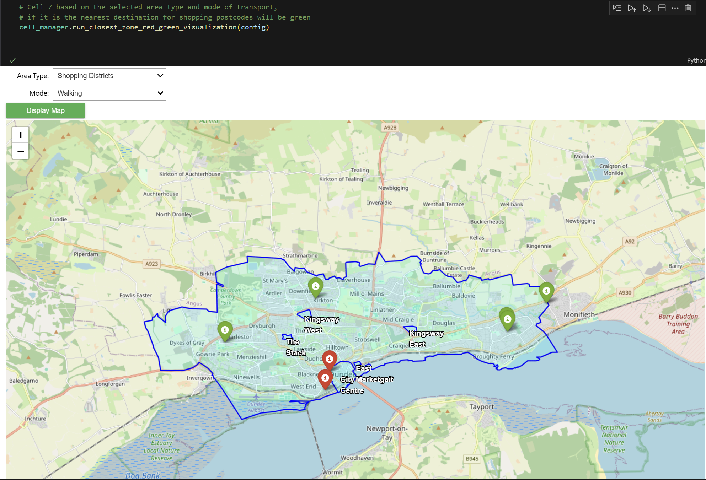
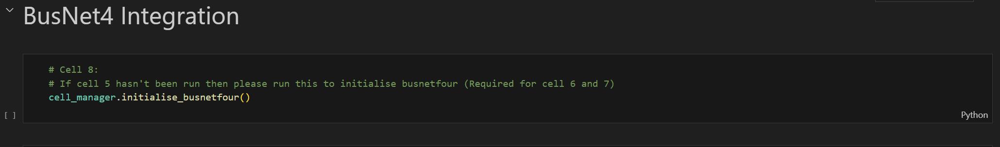
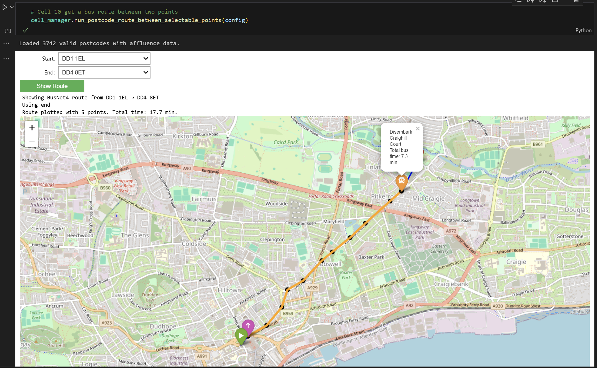

# Section 4 - Transport

### Cell 5
This cell will display walking, driving, cycling and bus routes from a postcode towards a destination with travel times.  
(It will also save the routes for future usage.)

- Step 1: Enter a postcode.  
- Step 2: Select a destination.  
- Step 3: Click **Calculate Routes** button.

>**Example input:**  
>  
>*Figure 15: Cell 5 transport input UI.*

>**Example output:**  
>  
>*Figure 16: Cell 5 transport output example.*

---

### Cell 6
This cell allows you to select different shopping areas to see which postcode locations are the closest to them based on transport type (walking, driving, etc.).  
It will also display the routes and travel times.  
(This uses the saved data created from Cell 5.)

- Step 1: Select area from the dropdown.  
- Step 2: Select transport mode from the next dropdown.  
- Step 3: Click **Accept**.

>**Example output:**  
>  
>*Figure 17: Cell 6 closest postcode routes output.*

---

### Cell 7
Similarly to Cell 6, Cell 7 shows all the closest postcodes to a selected shopping area in green, while postcodes that aren’t closest will be shown in red.

- Step 1: Select area from the dropdown.  
- Step 2: Select transport mode from the next dropdown.  
- Step 3: Click **Accept**.

>**Example output:**  
>  
>*Figure 18: Cell 7 closest and non-closest postcodes.*

---

### BusNet4 Integration
This subsection allows us to view and understand bus service routes between locations, including:  
- Total travel times  
- Times between stops  
- Bus service names  
- Walking distances between stops and destinations

### Cell 8
>  
>*Figure 19: Cell 8 BusNet4 initialisation.*  
>
>This cell needs to be run first as it sets things up in the background.

---

### Cell 10  
Displays the actual bus routes between the location with the above-mentioned information.

- Step 1: Select the start postcode.  
- Step 2: Select the end postcode.  
- Step 3: Click **Show Route**.

>**Example output:**  
>  
>*Figure 20: Cell 10 bus route output.*
